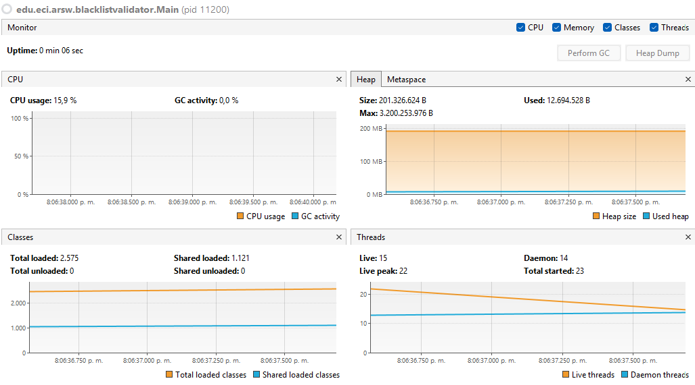
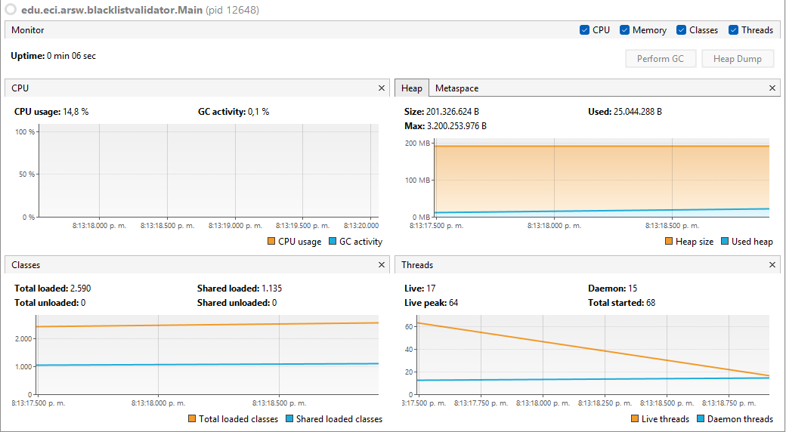

### ARSW - Arquitecturas de Software | Escuela Colombiana de Ingeniería
### Laboratorio No.1 | Introducción al paralelismo - Hilos - Caso BlackListSearch


___


**Integrantes (Grupo 1)**
  - Sergio Andrey Silva Rodríguez
  - Gerónimo Martínez Núñez

### Dependencias:
####   Lecturas:
*  [Threads in Java](http://beginnersbook.com/2013/03/java-threads/)  (Hasta 'Ending Threads')
*  [Threads vs Processes]( http://cs-fundamentals.com/tech-interview/java/differences-between-thread-and-process-in-java.php)

### Descripción
  Este ejercicio contiene una introducción a la programación con hilos en Java, además de la aplicación a un caso concreto.
  

### **Parte I - Introducción a Hilos en Java**

1. De acuerdo con lo revisado en las lecturas, complete las clases CountThread, para que las mismas definan el ciclo de vida de un hilo que imprima por pantalla los números entre A y B.

#### Implementacion del codigo

<p align="center">
  
</p>


2. Complete el método __main__ de la clase CountMainThreads para que:
	1. Cree 3 hilos de tipo CountThread, asignándole al primero el intervalo [0..99], al segundo [99..199], y al tercero [200..299].
	2. Inicie los tres hilos con 'start()'.
	3. Ejecute y revise la salida por pantalla.
	4. Cambie el incio con 'start()' por 'run()'. Cómo cambia la salida?, por qué?.

<p align="center">
  
</p>

Cuando en la clase `CountThreadsMain` se llama a `run()`, los tres objetos `CountThread` se ejecutan de manera **secuencial en el hilo principal** (`main`), como simples métodos, por lo que la salida se imprime en orden estricto: primero el mensaje `"Primer hilo"`, luego los números del 0 al 99, después el `"Segundo hilo"` seguido de su rango, y así sucesivamente. En cambio, al usar `start()`, cada objeto crea un **hilo independiente** y ejecuta su método `run()` de forma **concurrente**. Esto hace que el hilo principal imprima rápidamente los mensajes `"Primer hilo"`, `"Segundo hilo"` y `"Tercer hilo"`, mientras que los hilos creados comienzan a imprimir sus números en paralelo, produciendo una salida **intercalada y no determinista**, ya que el orden depende del planificador de la JVM y del sistema operativo.

---

**Parte II - Ejercicio Black List Search**


Para un software de vigilancia automática de seguridad informática se está desarrollando un componente encargado de validar las direcciones IP en varios miles de listas negras (de host maliciosos) conocidas, y reportar aquellas que existan en al menos cinco de dichas listas. 

Dicho componente está diseñado de acuerdo con el siguiente diagrama, donde:

- HostBlackListsDataSourceFacade es una clase que ofrece una 'fachada' para realizar consultas en cualquiera de las N listas negras registradas (método 'isInBlacklistServer'), y que permite también hacer un reporte a una base de datos local de cuando una dirección IP se considera peligrosa. Esta clase NO ES MODIFICABLE, pero se sabe que es 'Thread-Safe'.

- HostBlackListsValidator es una clase que ofrece el método 'checkHost', el cual, a través de la clase 'HostBlackListDataSourceFacade', valida en cada una de las listas negras un host determinado. En dicho método está considerada la política de que al encontrarse un HOST en al menos cinco listas negras, el mismo será registrado como 'no confiable', o como 'confiable' en caso contrario. Adicionalmente, retornará la lista de los números de las 'listas negras' en donde se encontró registrado el HOST.


Al usarse el módulo, la evidencia de que se hizo el registro como 'confiable' o 'no confiable' se dá por lo mensajes de LOGs:

INFO: HOST 205.24.34.55 Reported as trustworthy

INFO: HOST 205.24.34.55 Reported as NOT trustworthy


Al programa de prueba provisto (Main), le toma sólo algunos segundos análizar y reportar la dirección provista (200.24.34.55), ya que la misma está registrada más de cinco veces en los primeros servidores, por lo que no requiere recorrerlos todos. Sin embargo, hacer la búsqueda en casos donde NO hay reportes, o donde los mismos están dispersos en las miles de listas negras, toma bastante tiempo.

Éste, como cualquier método de búsqueda, puede verse como un problema [vergonzosamente paralelo](https://en.wikipedia.org/wiki/Embarrassingly_parallel), ya que no existen dependencias entre una partición del problema y otra.

Para 'refactorizar' este código, y hacer que explote la capacidad multi-núcleo de la CPU del equipo, realice lo siguiente:

1. Cree una clase de tipo Thread que represente el ciclo de vida de un hilo que haga la búsqueda de un segmento del conjunto de servidores disponibles. Agregue a dicha clase un método que permita 'preguntarle' a las instancias del mismo (los hilos) cuantas ocurrencias de servidores maliciosos ha encontrado o encontró.

#### Creación de la clase tipo Thread esta fue llamda `worker`

<p align="center">
  
</p>

2. Agregue al método 'checkHost' un parámetro entero N, correspondiente al número de hilos entre los que se va a realizar la búsqueda (recuerde tener en cuenta si N es par o impar!). Modifique el código de este método para que divida el espacio de búsqueda entre las N partes indicadas, y paralelice la búsqueda a través de N hilos. Haga que dicha función espere hasta que los N hilos terminen de resolver su respectivo sub-problema, agregue las ocurrencias encontradas por cada hilo a la lista que retorna el método, y entonces calcule (sumando el total de ocurrencuas encontradas por cada hilo) si el número de ocurrencias es mayor o igual a _BLACK_LIST_ALARM_COUNT_. Si se da este caso, al final se DEBE reportar el host como confiable o no confiable, y mostrar el listado con los números de las listas negras respectivas. Para lograr este comportamiento de 'espera' revise el método [join](https://docs.oracle.com/javase/tutorial/essential/concurrency/join.html) del API de concurrencia de Java. Tenga también en cuenta:

	* Dentro del método checkHost Se debe mantener el LOG que informa, antes de retornar el resultado, el número de listas negras revisadas VS. el número de listas negras total (línea 60). Se debe garantizar que dicha información sea verídica bajo el nuevo esquema de procesamiento en paralelo planteado.

	* Se sabe que el HOST 202.24.34.55 está reportado en listas negras de una forma más dispersa, y que el host 212.24.24.55 NO está en ninguna lista negra.}
#### Mpdificación de la clase `checkHost`
<p align="center">
  
</p>

#### Pruebas de IP'S
Prueba para la ip `202.24.34.55`
<p align="center">
  
</p>

Prueba para la ip `212.24.24.55`
<p align="center">
  
</p>

---

**Parte II.I Para discutir la próxima clase (NO para implementar aún)**

La estrategia de paralelismo antes implementada es ineficiente en ciertos casos, pues la búsqueda se sigue realizando aún cuando los N hilos (en su conjunto) ya hayan encontrado el número mínimo de ocurrencias requeridas para reportar al servidor como malicioso. Cómo se podría modificar la implementación para minimizar el número de consultas en estos casos?, qué elemento nuevo traería esto al problema?

#### Respuesta:
La mejora consiste en que los hilos dejen de buscar tan pronto el sistema detecte que ya se alcanzó el número mínimo de ocurrencias requeridas. Para lograrlo, se puede usar una variable compartida que actúe como bandera global: cuando un hilo alcanza el umbral, actualiza esa bandera y los demás hilos, al revisarla en su ciclo, se detienen sin seguir consultando listas innecesarias. Esto introduce al problema la necesidad de **sincronización y coordinación entre hilos**, no solo de paralelismo simple.


___


**Parte III - Evaluación de Desempeño**

A partir de lo anterior, implemente la siguiente secuencia de experimentos para realizar las validación de direcciones IP dispersas (por ejemplo 202.24.34.55), tomando los tiempos de ejecución de los mismos (asegúrese de hacerlos en la misma máquina):

Al iniciar el programa ejecute el monitor jVisualVM, y a medida que corran las pruebas, revise y anote el consumo de CPU y de memoria en cada caso.


---

**Computador**
El computador en el que se ejecuto tiene

- **CPU:** Intel(R) Core(TM) i3-2310M 2.10GHz
- **Núcleos:** 2
- **Hilos:** 2 por cada núcleo (4 en total)

**1. Un solo hilo**

**Tiempo de ejecución:** 1m 33s (93 segundos)


---

**2. Tantos hilos como núcleos de procesamiento (haga que el programa determine esto haciendo uso del [API Runtime](https://docs.oracle.com/javase/7/docs/api/java/lang/Runtime.html)).**


Para calcular los núcleos de procesamiento (De la máquina) con _Runtime_

```java
int processors = Runtime.getRuntime().availableProcessors();
```

**Tiempo de ejecución:** 16 segundos


---

**3. Tantos hilos como el doble de núcleos de procesamiento**

**Tiempo de ejecución:** 3 segundos

Aunque el gráfico muestre 6s, es 3 segundos. En el codigo se hace una pausa de 3s en el codigo para que alcance agarrar el *VisualVM* y poder sacar el screenshot puesto que sin esto pasa muy rápido.
```java
Thread.sleep(3000);
```




---

**4. 50 hilos: 3 segundos**




---

**5. 100 hilos: 2 segundos**


---

- **Con lo anterior, y con los tiempos de ejecución dados, haga una gráfica de tiempo de solución vs. número de hilos. Analice y plantee hipótesis con su compañero para las siguientes preguntas (puede tener en cuenta lo reportado por jVisualVM):**


| # Threads | Time (min:s)   | Time (seconds)    |
|-----------|----------------|-------------------|
| 1         | 1m 33s         | 93                |
| 4         | 0m 16s         | 16                |
| 8         | 0m 3s          | 3                 |
| 50        | 0m 3s          | 3                 |
| 100       | 0m 2s          | 2                 |


___

**Parte IV - Ejercicio Black List Search**

**1. Según la [ley de Amdahls](https://www.pugetsystems.com/labs/articles/Estimating-CPU-Performance-using-Amdahls-Law-619/#WhatisAmdahlsLaw?):**

$$
S(n) = \frac{1}{(1-P) + \frac{P}{n}}
$$


**Donde $S(n)$ es el mejoramiento teórico del desempeño, $P$ la fracción paralelizable del algoritmo, y $n$ el número de hilos, a mayor $n$, mayor debería ser dicha mejora. Por qué el mejor desempeño no se logra con los _500_ hilos?, cómo se compara este desempeño cuando se usan _200_?** 

**Análisis**

$P$ es la fracción paralelizable del algoritmo, es decir que es un porcentaje:

$$
0 \leq P \leq 1
$$

Cuando aumentamos el numero de hilos, cada vez más y más. La expresión se acerca a un valor. Matemáticamente:

$$
\lim_{n \to \infty} S(n) = \frac{1}{1-P}
$$

Llega un punto en el que _200_ hilos, hacen practicamente el mismo efecto en desempeño que si se usara _500_ o más hilos. La diferencia es mínima. Ya que $S(n)$ se aproxima a $\frac{1}{1-P}$


**Ejemplo**


Donde $S(n)$ es la línea Roja y $P = 50\%$. Se analiza que la mayor diferencia ocurre en aumentar hilos en cantidades pequeñas.

**2. Cómo se comporta la solución usando tantos hilos de procesamiento como núcleos comparado con el resultado de usar el doble de éste?**

Suponiendo $P = 98\%$, $S(n)$ se convierte casi en $n$. Teoricamente, el rendimiento (al duplicar los hilos) también se duplica.

En la práctica:

- $T_1 = 16s$ (4 Hilos)
- $T_2 = 3s$ (8 Hilos)

El rendimiento, es más grande que solo duplicarse. Hablando en numeros, aumentó en un $81\%$. Un rendimiento **_5.3_ veces mejor**.

**Nota:** Puede que usando otros modelos de _CPU_ varié mucho mejor o peor.


**3.1 De acuerdo con lo anterior, si para este problema en lugar de _100_ hilos en una sola _CPU_ se pudiera usar _1_ hilo en cada una de _100_ máquinas hipotéticas, la _ley de Amdahls_ se aplicaría mejor?**

**Hipótesis:** Uno pensaría que, si se distribuye el algoritmo en _100_ máquinas, al estas tener disponibilidad total del hardware
en la ejecución de cada tarea que se les asigne, se harían los cálculos más rápido, pero también toca tener en cuenta la
interconexión de estas máquinas para sincronizarse y ponerse de acuerdo (que de hecho sería vía red privada que tiene 
sus propias latencias a diferencia en _1_ sola máquina que las latencias serían a nivel de hardware y arquitectura).


**3.2 Si en lugar de esto se usaran $c$ hilos en $100/c$ máquinas distribuidas (siendo $c$ es el número de núcleos de dichas máquinas), se mejoraría?. Explique su respuesta**


**Datos:** Suponiendo $c = 4$ (Escenario promedio). Cantidad de máquinas es $\frac{100}{4}$, es decir $25$ máquinas.


- Cada núcleo va a tener un hilo dedicado, eliminando una sobrecarga o sobreprocesamiento que sucede cuando el número de hilo
es mayor al número de núcleos físicos.

- Analizando con la _Ley de Amdahl_, sigue siendo influido el rendimiento por la fracción paralelizable $P$ aunque se distribuya
el trabajo en más máquinas.

- Al hacer esto en múltiples máquinas, esto introduce latencias de red y sincronización entre las máquinas (Algo que no
existe en $1$ sola máquina a nivel de $1$ sola _CPU_)

En conclusión, si es posible mejorar el rendimiento al repartir los calculos a varias máquinas, pero la mejora no sería
proporcional al número de máquinas. Esto ocurre puesto que las máquinas necesitan sincronizarse y ponerse de acuerdo para
tener un orden y no dar resultados incorrectos, algo que hace consumir tiempo y recursos y reduce la ganancia total.


